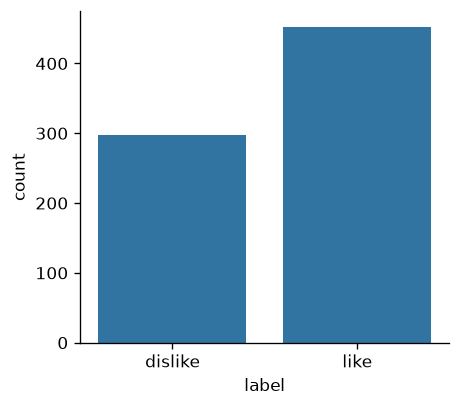
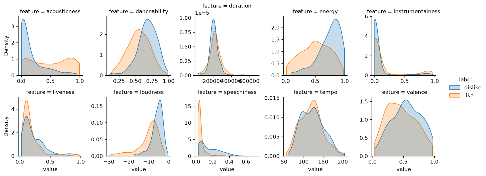
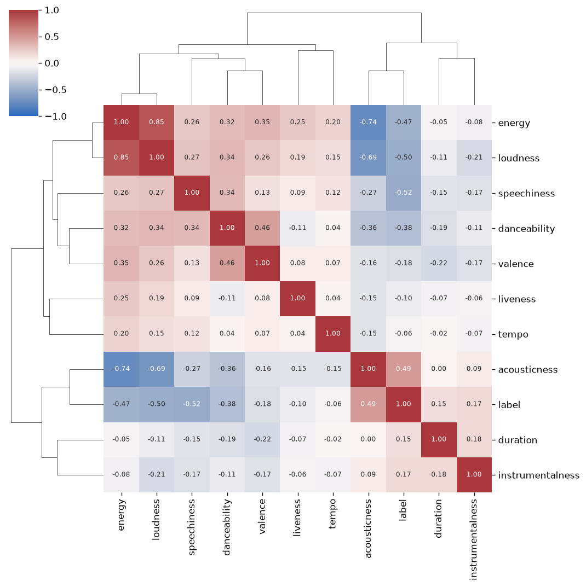
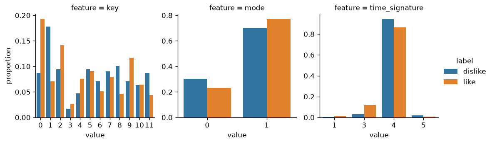

# 01 Exploration

What the 750 labelled songs look like before any model exists. Every
number here comes from `make explore` (`python -m songtaste.explore`)
on `training_data.csv` as fetched on 2026-10-01; the figures are in
`figures/`, drawn by `songtaste.explore` and viewable in
`notebooks/01_explore.ipynb`.

## In one paragraph

He likes quiet, acoustic, wordless-ish music and dislikes loud, energetic,
talky, danceable music. Four features carry most of that on their own
(speechiness, loudness, acousticness, energy), and two of them are nearly
the same feature. The rest is weak, and the categoricals add little beyond
a 3/4 tilt. The data is clean (no missing values, every column inside the
spec's ranges) but not tidy: 12 songs appear more than once, 4 songs sit in
both the training and the test file, and several features are a spike plus
a long tail rather than anything bell-shaped.

## Class balance

| label | songs | share |
|---|---|---|
| like | 452 | 0.603 |
| dislike | 298 | 0.397 |

Mild imbalance. A model that says "like" to everything is right 60% of
the time, so 0.60 accuracy is the floor any baseline is measured
against, and folds should be stratified so each keeps the 60/40.

## Which numeric features separate the classes

Each density is normalised within its class, so the 60/40 does not read
as separation. The AUC column is the chance a random liked song scores
higher than a random disliked one on that feature alone; 0.5 is nothing,
and distance from 0.5 is strength in either direction.

| feature | median, dislike | median, like | AUC | reading |
|---|---|---|---|---|
| speechiness | 0.114 | 0.040 | 0.195 | strong: liked songs have almost no speech; 36 of the 43 songs above 0.33 (rap, spoken parts) are disliked |
| loudness (dB) | -5.2 | -8.7 | 0.204 | strong: every one of the 36 songs quieter than -20 dB is liked |
| acousticness | 0.061 | 0.501 | 0.786 | strong: dislikes pile up near 0, likes spread across the range with a second hump near 1 |
| energy | 0.775 | 0.506 | 0.221 | strong, but it is loudness again (rank correlation 0.85) |
| danceability | 0.685 | 0.548 | 0.274 | moderate |
| valence | 0.549 | 0.438 | 0.393 | weak |
| instrumentalness | 0.000 | 0.000 | 0.595 | weak by AUC, but the tail matters: 14% of liked songs are instrumental (above 0.5) against 6% of disliked |
| duration (ms) | 206 039 | 220 814 | 0.588 | weak |
| liveness | 0.151 | 0.122 | 0.438 | weak |
| tempo (BPM) | 122.7 | 119.9 | 0.465 | none to speak of |

The rank correlations (Spearman, because several features are heavily
skewed) cluster into one block: energy, loudness and acousticness move
together (energy with loudness 0.85, energy with acousticness -0.74) and
together they are the "loud vs. acoustic" axis his taste runs along.
Speechiness correlates with the label (-0.52) more than with any other
feature, so it is the one strong signal that is not that axis restated.
Tempo and liveness are close to noise against everything.

## Oddities

Counted as values more than three interquartile ranges beyond the
quartiles.

| feature | min | median | max | far out (train) | far out (test) |
|---|---|---|---|---|---|
| duration (ms) | 33 840 | 215 109 | 675 360 | 8 | 0 |
| loudness (dB) | -29.6 | -7.3 | -0.5 | 12 | 4 |
| speechiness | 0.023 | 0.049 | 0.721 | 36 | 18 |
| liveness | 0.024 | 0.129 | 0.979 | 20 | 3 |
| instrumentalness | 0.000 | 0.000 | 0.967 | 149 | 41 |
| tempo (BPM) | 55.7 | 120.1 | 204.2 | 0 | 0 |

- **Duration** runs from a 34-second track to an 11-minute one; 15
  songs are under 90 s and 8 over 8 minutes. Real songs, not errors, but
  they will dominate a distance unless scaled robustly or log-transformed.
- **Loudness** has a long quiet tail, and that tail is all likes. These
  "outliers" are signal and must not be clipped away.
- **Instrumentalness** is a spike at zero (median 0.000) with a thin
  tail toward 1. The 149 "far out" values are the tail, not errors: the
  IQR is tiny because most songs have vocals. Closer to a binary "has
  vocals" flag than to a continuous measure.
- **Speechiness** is the same shape, a spike near 0.04 with a tail that
  is mostly dislikes.
- **Tempo** is well behaved: roughly symmetric, no extremes.
- **Duplicates.** 14 training rows repeat another row exactly (12 distinct
  songs, two of them three times), always with the same label, so the
  file never contradicts itself (the contract checks this). 4 distinct
  songs appear in both the training and the test file, and the test file
  repeats one song once. Duplicates matter for evaluation: a song in both
  a training fold and its validation fold inflates cross-validated
  accuracy, most for kNN and deep trees, which memorise.

## The categoricals

| feature | value | songs | share liked |
|---|---|---|---|
| mode | 0 (minor) | 194 | 0.536 |
| mode | 1 (major) | 556 | 0.626 |
| time_signature | 1 | 6 | 0.833 |
| time_signature | 3 | 64 | 0.844 |
| time_signature | 4 | 671 | 0.581 |
| time_signature | 5 | 9 | 0.333 |
| key | 0 (C) | 113 | 0.770 |
| key | 1 (C♯/D♭) | 85 | 0.376 |
| key | 8 (G♯/A♭) | 51 | 0.412 |
| key | 11 (B) | 46 | 0.435 |
| key | the other eight | 455 | between 0.52 and 0.72 |

- **mode** separates a little (63% liked in major, 54% in minor).
- **key** swings from 38% liked (C♯) to 77% (C), but with 12 levels and
  17 to 113 songs each, much of that swing is what chance does to small
  groups. Worth one-hot encoding and letting regularisation or the
  comparison decide; not worth believing on sight.
- **time_signature** is nearly 90% 4/4. The informative level is 3/4: 84% liked
  across 64 songs, likely waltzes, folk and ballads that ride the same
  acoustic axis. Levels 1 and 5 have 6 and 9 songs, too few to read.

**time_signature, numeric or categorical.** For numeric: it is a count
of beats per bar, so the codes are ordered and a tree could split it
just as well as a one-hot. For categorical: the values are distinct
meters rather than points on a scale (nothing makes 5/4 "more" than 4/4
in a way that bears on taste), the pattern is one level (3) standing
apart rather than a trend, and 1 is what Spotify reports when it could
not settle a meter, which is not a meter at all. It is typed categorical
in the contract. With 15 songs in levels 1 and 5, an encoding that
groups rare levels (or a binary "is 3/4") is worth trying in task 2.

## What this suggests for scaling and encoding

- **Scale, and scale robustly.** The features live on wildly different
  ranges (duration in hundreds of thousands, the confidences in 0 to 1,
  loudness negative), so kNN, SVM and logistic regression need scaling.
  Duration and the spiky features argue for a log or quantile transform
  or `RobustScaler` over plain standardisation; trees do not care.
- **Do not clip the tails.** The extreme quiet and extreme speechy songs
  are where the label is most certain.
- **One-hot the three categoricals**, possibly grouping time_signature's
  rare levels; mode is already 0/1.
- **Expect redundancy.** Energy, loudness and acousticness carry one
  axis; LDA and logistic regression will share weight among them, and a
  feature-selection pass may drop one at little cost. Tempo and liveness
  are candidates to drop.
- **Mind the duplicates in evaluation.** Either drop exact duplicates
  before cross-validation or group them so a song never sits in both
  sides of a fold. The protocol (task 2) should decide which, before any
  result exists.
- **Accuracy floor 0.60**, stratified folds.
