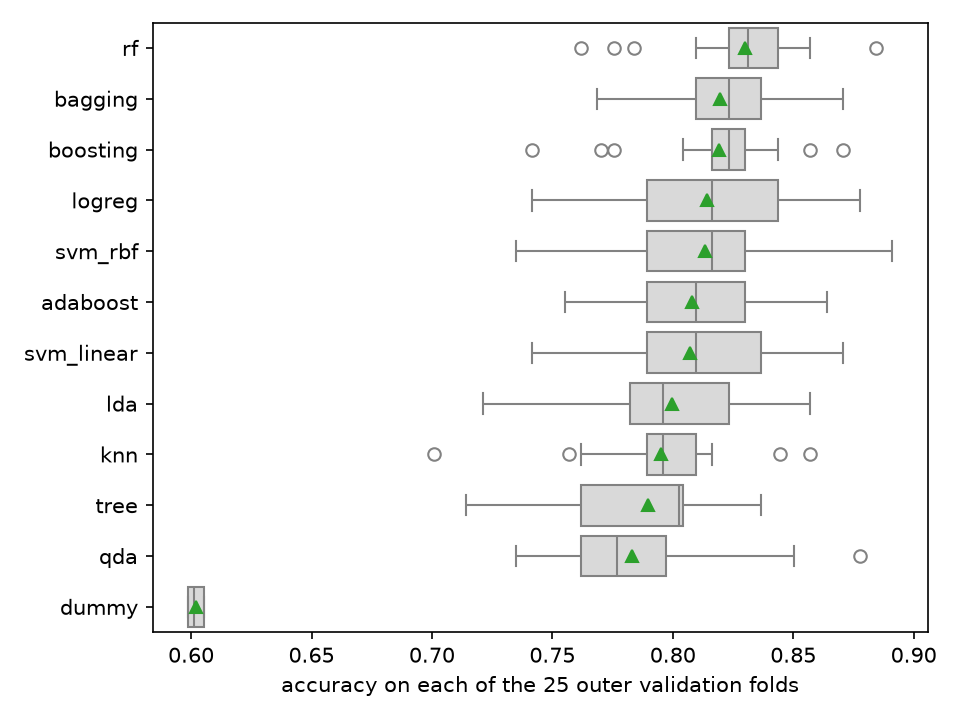

# 03 Sweep

Every method family the lab names through the protocol (`protocol.md`,
committed before any model number existed), on the same 25 outer
splits as the baselines: 736 songs after dropping exact duplicates,
5 folds times 5 repeats, seed 65, every search inside the outer
training part. The baselines' rows are copied from `02-baselines.csv`,
not recomputed. `make sweep` regenerates `03-sweep.csv` byte for byte
(about 36 minutes on 4 cores, the largest share of it the random forest) and prints
every table below; `notebooks/03_compare.ipynb` calls the same
functions in `songtaste.report`.

Nine methods joined the three baselines. Each one's grid is in
`songtaste/models.py`, a handful of values per knob:

- **lda**, nothing searched.
- **qda**, with `reg_param` searched, since one covariance per class
  over 28 columns, some of them collinear one-hot ones, is singular
  without shrinkage.
- **tree**, with `max_depth` and `min_samples_leaf`.
- **rf**, 300 trees, with `max_features` and `min_samples_leaf`.
- **bagging**, 300 full-feature trees, with `min_samples_leaf`.
- **boosting**, sklearn's `HistGradientBoostingClassifier`, with
  `learning_rate`, `max_depth` and `max_iter`. It fits the same
  additive model of shallow trees as classic gradient boosting and is
  the variant sklearn recommends.
- **adaboost**, stumps, with `learning_rate` and `n_estimators`. It is
  the textbook variant, and it cost 15 seconds per split, so it went in
  as its own entry.
- **svm_linear**, with `C`.
- **svm_rbf**, with `C` and `gamma`.

The tree-based methods keep the shared scaler. It changes no split,
and keeping it means one pipeline shape for every method.

## The comparison

Mean over the 25 splits with the corrected standard error
(`protocol.md`, "Uncertainty"), best accuracy first. "Searched" is the
number of tuned hyperparameters, which the decision rule counts.

| method | accuracy | balanced accuracy | ROC AUC | searched | setting chosen most often (splits of 25) |
|---|---|---|---|---|---|
| rf | **0.830 ± 0.014** | 0.820 ± 0.015 | 0.907 ± 0.011 | 2 | max_features sqrt, min_samples_leaf 1 (6) |
| bagging | 0.820 ± 0.014 | 0.809 ± 0.014 | 0.899 ± 0.011 | 1 | min_samples_leaf 1 (10) |
| boosting | 0.819 ± 0.014 | 0.808 ± 0.014 | 0.896 ± 0.010 | 3 | learning_rate 0.03, max_depth none, max_iter 300 (4) |
| logreg | 0.814 ± 0.019 | 0.801 ± 0.018 | 0.886 ± 0.013 | 1 | C 0.032 (12) |
| svm_rbf | 0.813 ± 0.019 | 0.800 ± 0.019 | 0.885 ± 0.013 | 2 | C 1, gamma 0.01 (10) |
| adaboost | 0.808 ± 0.016 | 0.793 ± 0.016 | 0.887 ± 0.013 | 2 | learning_rate 0.3, n_estimators 300 (7) |
| svm_linear | 0.807 ± 0.017 | 0.794 ± 0.016 | 0.884 ± 0.013 | 1 | C 0.01 (20) |
| lda | 0.799 ± 0.017 | 0.787 ± 0.017 | 0.878 ± 0.013 | 0 | none |
| knn | 0.795 ± 0.016 | 0.768 ± 0.018 | 0.880 ± 0.011 | 2 | n_neighbors 21, distance (4) |
| tree | 0.790 ± 0.016 | 0.775 ± 0.018 | 0.847 ± 0.016 | 2 | max_depth 3, min_samples_leaf 20 (6) |
| qda | 0.783 ± 0.018 | 0.787 ± 0.018 | 0.878 ± 0.015 | 1 | reg_param 0.25 (17) |
| dummy | 0.602 ± 0.002 | 0.500 ± 0.000 | 0.500 ± 0.000 | 0 | none |

The full per-split choice is the `params` column of the CSV. Mean fit
time per outer split, inner search included (seconds, not in the CSV):
rf 37, boosting 21, adaboost 16, bagging 6.5, svm_rbf 2.5, tree 2.4,
svm_linear 0.8, qda 0.6, lda 0.01.

`figures/03-accuracy-by-split.png`: each box is one method's 25
per-split accuracies, the triangle its mean. The boxes overlap
almost entirely from rf down to lda. That is why the comparison has to
be paired. Most of the spread is in which songs land in a fold, and
that is shared by every method scored on that fold.

## Paired against the best

Each method minus rf on the same 25 splits. Following sklearn's example
on statistically comparing models (`songtaste.report.paired`):

- **gap** is the mean of the per-split differences, and **se** is its
  corrected error.
- **p** is the corrected resampled t-test's two-sided p-value.
- The last three columns read a Student t posterior over the gap, with
  a region of practical equivalence of ±0.01 accuracy. They give the
  probability that rf is better by more than a point, that the two are
  within a point of each other, and that the method beats rf by more
  than a point.

| method | gap | se | p | rf better | equivalent | method better | rf wins / ties of 25 |
|---|---|---|---|---|---|---|---|
| bagging | -0.0106 | 0.0072 | 0.15 | 0.53 | 0.46 | 0.00 | 18 / 3 |
| boosting | -0.0109 | 0.0090 | 0.24 | 0.54 | 0.45 | 0.01 | 19 / 2 |
| logreg | -0.0160 | 0.0149 | 0.29 | 0.66 | 0.30 | 0.05 | 18 / 1 |
| svm_rbf | -0.0169 | 0.0151 | 0.28 | 0.67 | 0.28 | 0.04 | 17 / 4 |
| adaboost | -0.0223 | 0.0130 | 0.10 | 0.82 | 0.17 | 0.01 | 19 / 3 |
| svm_linear | -0.0231 | 0.0134 | 0.10 | 0.83 | 0.16 | 0.01 | 21 / 1 |
| lda | -0.0307 | 0.0144 | 0.04 | 0.92 | 0.08 | 0.00 | 19 / 3 |
| knn | -0.0351 | 0.0140 | 0.02 | 0.96 | 0.04 | 0.00 | 22 / 0 |
| tree | -0.0405 | 0.0171 | 0.03 | 0.96 | 0.04 | 0.00 | 22 / 1 |
| qda | -0.0473 | 0.0195 | 0.02 | 0.97 | 0.03 | 0.00 | 22 / 0 |
| dummy | -0.2283 | 0.0143 | 0.00 | 1.00 | 0.00 | 0.00 | 25 / 0 |

## The decision

`protocol.md` stated the rule before any number existed:

> **Among the non-dummy methods whose mean accuracy is within one
> corrected standard error of the best method's, where the error is that
> of their 25 paired per-split differences from the best, task 3 chooses
> the one with the fewest searched hyperparameters, ties broken by the
> order below.**

The best method is rf at 0.830. A method qualifies when its gap is no
larger than the corrected error of that gap, and no other method does:

- bagging misses by 0.0106 against 0.0072;
- boosting by 0.0109 against 0.0090;
- logreg by 0.0160 against 0.0149;
- svm_rbf by 0.0169 against 0.0151.

The band therefore holds rf alone, and the count of hyperparameters
and the tie order never come into play. **The chosen method is the
random forest (`rf`)**, refit for task 4 by the same `GridSearchCV`
over the deduplicated training set. adaboost is not in the protocol's
tie order, since the sketch did not name it. `report.SIMPLICITY` ranks
it after boosting, and that ranking decided nothing here.

## Reading

The random forest won, and the order of the table reads like a
bias-variance story about this data. We have 736 songs, 13 features,
and one dominant direction: quiet, acoustic, wordless songs are liked,
loud, energetic, talky ones are not (`01-exploration.md`). A linear
boundary already captures most of that, which is why logistic regression
reaches 0.814 with heavy shrinkage. What it cannot express is the
leftover structure. Task 1 found every song under -20 dB liked and the
3/4 meter mostly liked. Those are threshold effects and interactions
of the kind a tree finds and a straight line averages away. A single
tree does find them, but with 590 training songs per split it pays in
variance. Its search kept choosing depth 3 or 4 with large leaves, and
it still finished below logistic regression, with the worst ROC AUC of
any real method. Averaging many deep trees keeps the tree's low bias
and pays down the variance. Bagging does that (0.820). The forest's
random feature subsets decorrelate the trees further and add one more
point (0.830). Boosting reaches the same place from the other side:
small learners, low variance, bias removed step by step. It ties with
bagging. The forest also has the tightest spread of any real method
apart from bagging (per-split standard deviation 0.027, against
0.035 for logistic regression). On every score, accuracy, balanced
accuracy and AUC alike, it is first, so the win is not bought by
leaning on "like".

kNN and QDA sat at the bottom, for reasons the exploration predicted.
kNN's distance mixes ten standardised numeric axes with eighteen 0/1
columns, so a song's neighbours are partly chosen by sharing a key.
Its search never settled, choosing anything from 5 to 51 neighbours,
the sign of a flat validation curve. QDA estimates a full covariance
per class from about 240 dislikes over 28 columns. That is too many
parameters for the data, and even after the shrinkage the search
settled on (`reg_param` 0.25 on 17 of 25 splits) it was the worst
real method on accuracy. It is the one method whose balanced accuracy
(0.787) sits above its accuracy (0.783): the separate dislike
covariance pulls the boundary towards calling songs disliked. LDA, the
same model with one shared covariance, does better (0.799), which is
the variance cost of QDA's extra parameters made visible.

Did the ensembles beat the linear baseline by more than noise? Only
just, and that "just" is the honest answer to give. The forest's
gap to logistic regression is 0.016 with a corrected error of 0.015.
The corrected t-test gives p = 0.29, and the posterior gives the
forest a two-in-three chance of being better by more than a point. It
wins on 18 of the 25 splits. Bagging and boosting are closer still:
bagging beats logistic regression on only 12 of the 25. So the rule
picks the forest because it is best and nothing else sits within one
corrected error of it. It does not pick it because the ensembles are
clearly a different class. A reader expecting a 0.83 on the 200
hidden songs should expect anything from about 0.80 to 0.86. The
expected edge over logistic regression is about a point and a half,
which is three songs out of two hundred.
