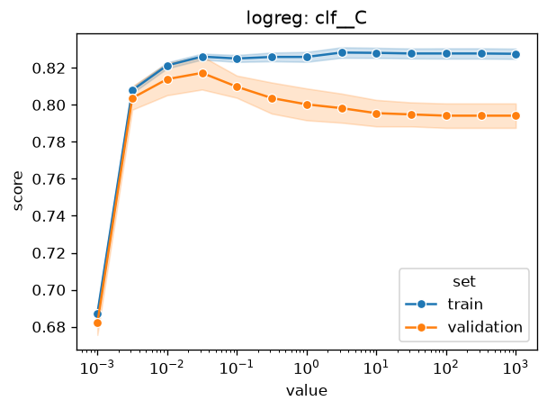
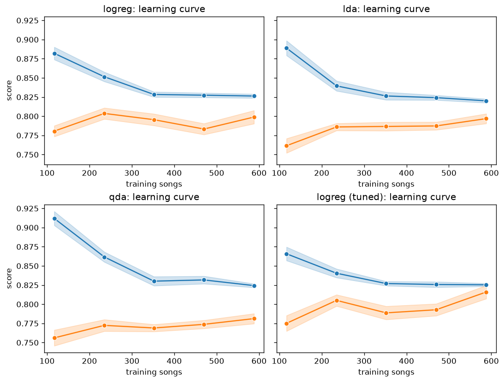
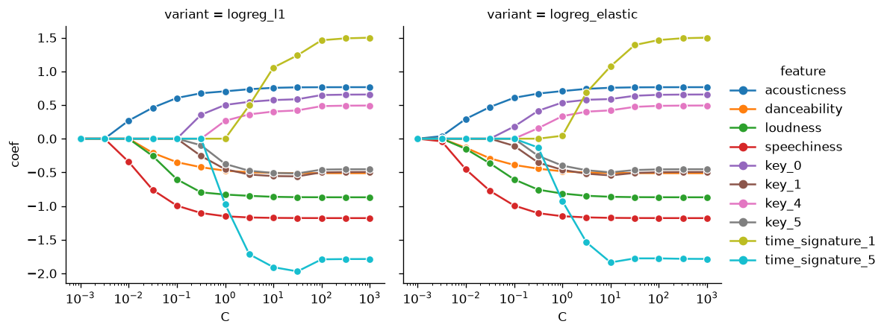
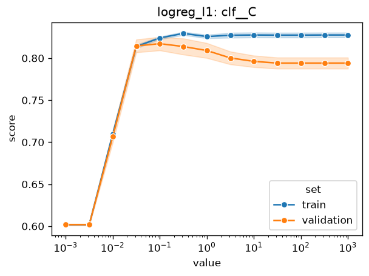
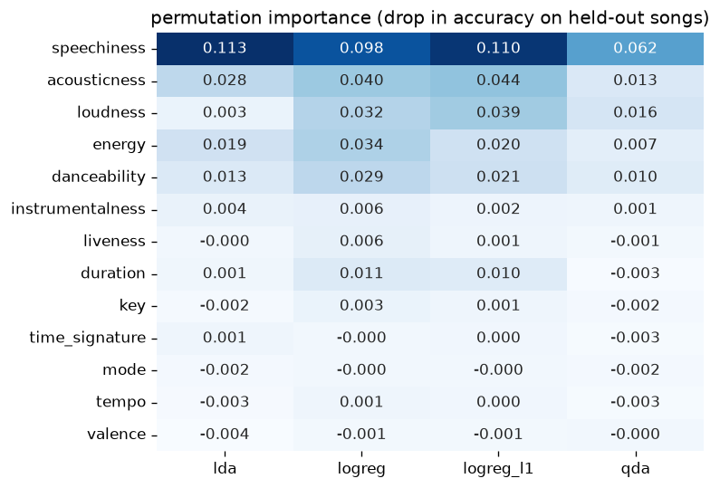
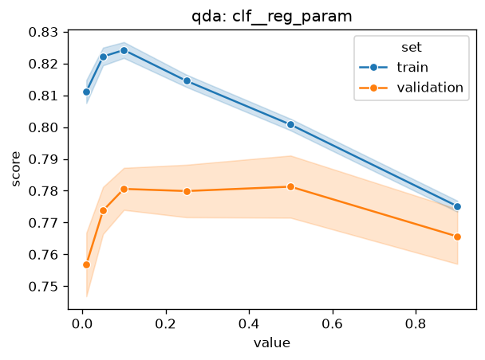
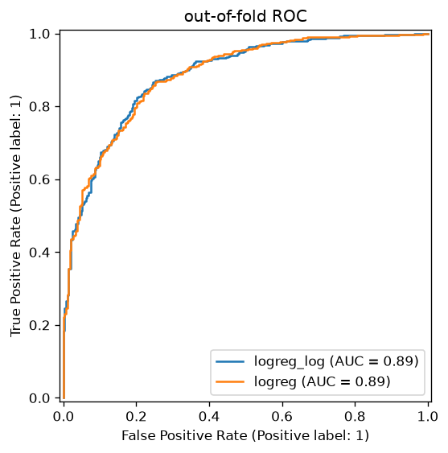
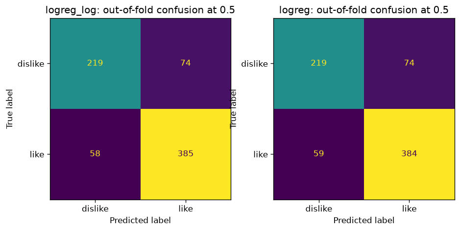

# 04 Variants: the linear family

Logistic regression, LDA and QDA with their knobs turned, through the
screen (`protocol.md`, section 2026-10-02): the same stratified 5 folds
at seed 65 as the sweep, two repeats instead of five, so ten outer
splits per variant, every search inside the outer training part. Every
number in the table comes from `04-variants-linear.csv`, which
`make variants FAMILY=linear` writes (and, when the file already holds
the family, reads back without refitting). Numbers from the screen are
screen numbers: they sit on ten splits, not the sweep's twenty-five,
and none of them is a full-protocol number. Where this note mentions a
03-sweep figure it says so.

What each variant changes is in `songtaste.variants` (the `note` of
each `Variant`, or `variants.catalogue()`). In short: L1 and elastic
net change the penalty, robust, quantile and log change how the
numeric columns are scaled, top4 keeps speechiness, loudness,
acousticness and energy, numeric drops the three categoricals,
grouped folds rare key and meter levels into one column, interactions
adds every pairwise product of the ten numeric features, and shrink
replaces LDA's covariance estimate by a Ledoit-Wolf shrunk one.

## The family on the screen

`variants.summarize` over the CSV, best accuracy first within each
base. The gap is the variant minus its own base on the same ten
splits; its error is the corrected standard error of those ten
differences (`protocol.md`, "Uncertainty"). The last column counts
the splits where the variant beat its base and where they tied.

| variant | base | accuracy | balanced accuracy | ROC AUC | gap to base | se of gap | wins / ties of 10 |
|---|---|---|---|---|---|---|---|
| logreg_log | logreg | 0.819 ± 0.014 | 0.805 ± 0.015 | 0.887 ± 0.010 | +0.004 | 0.005 | 4 / 5 |
| logreg | logreg | 0.815 ± 0.016 | 0.801 ± 0.016 | 0.885 ± 0.010 | | | |
| logreg_grouped | logreg | 0.815 ± 0.016 | 0.801 ± 0.016 | 0.885 ± 0.010 | +0.000 | 0.000 | 0 / 10 |
| logreg_elastic | logreg | 0.815 ± 0.013 | 0.803 ± 0.014 | 0.888 ± 0.010 | -0.000 | 0.007 | 4 / 3 |
| logreg_l1 | logreg | 0.814 ± 0.015 | 0.801 ± 0.015 | 0.884 ± 0.010 | -0.001 | 0.009 | 6 / 1 |
| logreg_quantile | logreg | 0.813 ± 0.016 | 0.805 ± 0.016 | 0.890 ± 0.010 | -0.002 | 0.009 | 4 / 1 |
| logreg_robust | logreg | 0.811 ± 0.015 | 0.797 ± 0.017 | 0.888 ± 0.010 | -0.003 | 0.012 | 4 / 2 |
| logreg_interactions | logreg | 0.810 ± 0.017 | 0.791 ± 0.021 | 0.891 ± 0.014 | -0.004 | 0.021 | 4 / 1 |
| logreg_numeric | logreg | 0.810 ± 0.016 | 0.797 ± 0.015 | 0.886 ± 0.011 | -0.004 | 0.008 | 3 / 3 |
| logreg_top4 | logreg | 0.804 ± 0.013 | 0.790 ± 0.014 | 0.882 ± 0.010 | -0.011 | 0.010 | 2 / 1 |
| lda_shrink | lda | 0.806 ± 0.013 | 0.798 ± 0.012 | 0.881 ± 0.009 | +0.012 | 0.008 | 8 / 1 |
| lda_top4 | lda | 0.806 ± 0.017 | 0.789 ± 0.015 | 0.878 ± 0.010 | +0.012 | 0.020 | 7 / 0 |
| lda | lda | 0.794 ± 0.011 | 0.781 ± 0.012 | 0.877 ± 0.010 | | | |
| qda_top4 | qda | 0.790 ± 0.013 | 0.785 ± 0.012 | 0.876 ± 0.011 | +0.015 | 0.009 | 8 / 0 |
| qda_numeric | qda | 0.777 ± 0.020 | 0.780 ± 0.019 | 0.875 ± 0.013 | +0.001 | 0.011 | 5 / 1 |
| qda | qda | 0.775 ± 0.014 | 0.778 ± 0.013 | 0.876 ± 0.011 | | | |

Three gaps clear their own error: lda_shrink (+0.012 against 0.008),
qda_top4 (+0.015 against 0.009) and, only just and in the wrong
direction, logreg_top4 (-0.011 against 0.010). Everything else on the
logistic side sits inside its error, most of it by a wide margin.

## What would be promoted

**Nothing from this family clears the promotion rule.**
`variants.promoted` takes the family's best mean, which is logreg_log
at 0.819, and asks whether its gap to logreg beats the error of that
gap. It does not: +0.004 against 0.005, a win on four splits, a tie on
five (the log only moves the few songs whose duration, speechiness,
instrumentalness or liveness sit far out in a tail; on the
out-of-fold predictions below it changes the call on 7 of 736 songs).
The two variants whose gaps do clear their error, lda_shrink and
qda_top4, are not the family's best, so the rule as written never
looks at them; and even read per base, they would lift LDA and QDA to
0.806 and 0.790, still below plain logistic regression on the same
screen.

## Logistic regression

**What moved it, and what did not.** Almost nothing moves it. The
penalty (L2, L1, elastic net), the scaling (standard, robust,
quantile, log1p on the spiky four), the encoding of the categoricals
(one-hot, grouped, dropped) all land within half a point of 0.815,
with gaps that are smaller than their errors. The one change that
clearly costs is throwing features away: logreg_top4 loses 0.011, just
past its error. The interactions variant has the widest gap error of
the family (0.021): it loses 0.075 on one split and wins 0.061 on
another, and it has the best ROC AUC of all (0.891) with the worst
balanced accuracy on the logistic side (0.791). What does matter is
C, the inverse of the penalty strength, and the search already finds
it. The validation curve peaks at C = 0.03 (0.817 against 0.794
unpenalised, train at 0.826 from C = 0.03 on), and the search picked
0.01 to 0.1 on every split.

**Why, in the course's terms.** Logistic regression is a straight
boundary in whatever features it is given (`Classification and
logistic regression.md`), and on this data one straight boundary
already lies along the loud-versus-acoustic axis with speechiness on
the side. Rescaling a column changes how far apart its values are,
which a line absorbs into its coefficient; only a monotone bend (log,
quantile) changes what a line can express, and with the tails being a
few dozen songs that bend reaches few of the decisions. The penalty
is the part that bites: the train score is flat from C = 0.03 upward
while the validation score falls by two points, which is the
overfitting `Polynomial regression and regularisation.md` describes,
here coming from the eighteen one-hot columns more than from the ten
numeric ones. The learning curves say the same from the other side:
tuned, the validation score reaches 0.816 at 588 songs with the train
score at 0.825, a gap under a point, so this is a model limited by
bias, not by data, and more songs would not help it much.

(Blue is the train score, orange the validation score; each band is
one standard error over the ten splits. The top-left panel is
logistic regression at sklearn's default C = 1, the bottom-right with
C searched inside each split.)

**Which features L1 keeps.** Read off the L1 pipeline refit on all
736 songs over the C grid (`clf.coef_` against the preprocessor's
`get_feature_names_out`), speechiness, acousticness and energy enter
first (C = 0.01), danceability and loudness next (C = 0.03), then
tempo, instrumentalness and duration (C = 0.1). At C = 0.1, which the
search chose on six of ten splits, L1 keeps those eight numeric
features and sets every one of the eighteen one-hot columns, liveness
and valence to exactly zero. Keys first enter at C = 0.3; valence
holds out until C = 316. That is the LASSO's "selection" in
`Polynomial regression and regularisation.md`: four of the
exploration's strong features plus a few weak ones survive, and the
categoricals are switched off. Elastic net keeps the same order, with
key 0 and key 1 entering earlier, since its L2 half lets correlated
columns share weight instead of one of them winning. Neither scores
differently from L2 (gaps -0.001 and -0.000): L2 at C = 0.03 already
shrinks the key columns to coefficients under 0.2 against speechiness
at -0.79, so zeroing them changes few predictions. The rare meter
levels (time signature 1 and 5, five and nine songs) are the
coefficients that blow up when the penalty is lifted, to +1.5 and
-1.8 respectively; they are what the penalty is protecting against.

The L1 validation curve shows the price of selecting too hard: below
C = 0.01 every coefficient is zero and the model is the majority
class (0.602); from C = 0.03 to 0.3 it matches L2's peak (0.815 to
0.817); above that it decays to the same unpenalised 0.794.

**The speechiness-with-loudness-axis effect.** His pair screen with a
depth-4 tree found energy with speechiness worth about 0.1 of ROC AUC
over the better of the two alone. The interactions variant does not
recover it as such: at the C its search chose most often (0.01), the
energy-by-speechiness product has a coefficient of -0.005 and
loudness-by-speechiness 0.030, against -0.47 for speechiness itself.
What it does pick up is the same axis from its acoustic end:
acousticness-by-speechiness is the largest product in the model at
+0.136 (speech hurts a song less when it is acoustic), alongside
instrumentalness-by-speechiness at +0.131. A product term is a smooth
tilt of the boundary, while the tree's gain comes from a threshold
(speech above about a third is disliked whatever the energy), and the
45 extra columns push the search to a stronger penalty that shrinks
the main effects too. `Non-linear input transformations.md` is the
frame: the product feature buys a curved boundary only if the curve
the data wants is the one the product draws, and here the screen says
it is not, on balance (-0.004 ± 0.021).

## LDA

**What moved it, and what did not.** Shrinkage moved it: lda_shrink
beats plain LDA by 0.012 against an error of 0.008, on eight splits of
ten. Keeping only the four strong features gains the same 0.012 on
the mean but with an error of 0.020, so the screen cannot tell it from
noise. Nothing is searched for LDA in either form.

**Why, in the course's terms.** LDA fits a mean per class and one
pooled covariance shared by both (`Gaussian mixture models and
discriminant analysis.md`), and the boundary is linear because the
shared covariance cancels. That covariance has 28 columns, 18 of
them one-hot columns that are exact linear combinations of each
other within a categorical (the levels of key sum to one), so the
plain estimate is singular and sklearn's default solver gets around
it by discarding the directions with no variance. Ledoit-Wolf
shrinkage instead pulls the estimate toward a scaled identity, which
keeps every direction but damps the noisy small-variance ones that
the thin key and meter levels create. It is the same idea as the
penalty on logistic regression, put on the covariance instead of the
weights. Shrunk, LDA closes most of its distance to logistic
regression on the screen (0.806 against 0.815), which is what the
book predicts for two linear classifiers fitted differently: LDA by
the joint likelihood, logistic regression by the conditional one, and
"in most practical cases this does not make a big difference". The
learning curve has the same shape as logistic regression's, a train
score falling to 0.820 and a validation score rising to 0.797, again
a gap of about two points with little left for more data to close.

The permutation importances show one thing LDA does differently: it
barely uses loudness (0.003 of accuracy lost when loudness is
shuffled, against 0.032 for logistic regression), carrying the axis on
acousticness and energy instead. Loudness and energy correlate at
0.85, so the pooled covariance lets LDA put the shared signal on
either; shuffling one then costs little because the other still
carries it. Permutation importance undercounts features that have a
correlated twin, and this is the case where it shows.

## QDA

**What moved it, and what did not.** Fewer features moved it:
qda_top4 beats plain QDA by 0.015 against 0.009, on eight splits of
ten. Dropping only the categoricals (qda_numeric, ten columns instead
of 28) did nothing (+0.001 ± 0.011). The reg_param validation curve is
flat from 0.1 to 0.5 (0.781, 0.780, 0.781) and falls on both sides; at
0 the class covariances are singular and the fit fails, which is why
the curve starts at 0.01 (0.757).

**Why it sits where it sits.** QDA gives each class its own
covariance (`Gaussian mixture models and discriminant analysis.md`),
so the boundary is quadratic, at the price of a full covariance per
class: 406 numbers each over 28 columns, estimated from about 240
dislikes. That is the variance cost the book trades against LDA's one
shared covariance, and on this data QDA pays it. It is the worst
method of the family on accuracy (0.775 on the screen) and its
learning curve has the widest train-validation gap (0.824 against
0.781 at 588 songs) and the slowest climb. Ten numeric columns
(55 numbers per class) are still too many for the dislikes; four
(10 numbers per class) are few enough to estimate, and that is where
QDA gains. Its balanced accuracy (0.778) sits above its accuracy in
the plain form, as 03-sweep found under the full protocol: the
separate dislike covariance is wider, which pulls the boundary
toward calling songs disliked. What QDA buys with its curved boundary,
logistic regression on the same four features does not need: QDA on
four features (0.790) still sits below logistic regression on all of
them (0.815), and even below logistic regression on the same four (0.804).

## Across the three

The permutation importances, each method searched inside each of the
ten splits, agree on the order of the top: speechiness first by a
wide margin for every method (0.06 to 0.11 of accuracy lost when it
is shuffled), then the loud-versus-acoustic axis (acousticness,
loudness, energy) and danceability. Key, mode, time signature, tempo
and valence cost nothing measurable for any of the four. That is the
exploration's ranking, robust across these four models, and it is why
dropping the categoricals or folding their rare levels changes
nothing.

The best variant, logreg_log, and plain logreg are nearly the same
classifier on the out-of-fold predictions (one stratified 5-fold at
seed 65, searched inside): the same ROC AUC (0.886), the same 219 of
293 dislikes caught, 385 against 384 likes, and 0.5 is already the
best threshold for both on the threshold table.

## How these were made

Every figure is one `songtaste.diagnostics` call or one seaborn call,
on `X, y = evaluate.training_xy(variants.SCREEN)` with
`protocol=variants.SCREEN`:

- `validation_curve_table` for `clf__C` over `np.logspace(-3, 3, 13)`
  on logreg and logreg_l1, and for `clf__reg_param` over 0, 0.01,
  0.05, 0.1, 0.25, 0.5, 0.9 on qda, each drawn by
  `plot_validation_curve`;
- `learning_curve_table` for logreg, lda and qda at their defaults
  and for logreg with `tuned=True`, drawn by `plot_learning_curves`;
- `permutation_table(["logreg", "logreg_l1", "lda", "qda"], tuned=True)`,
  then `importance_matrix` and `plot_importance_matrix`;
- `oof_predictions` (tuned) for logreg_log and logreg, then
  `plot_roc`, `plot_confusion` and `threshold_table`;
- the coefficient paths: each of logreg_l1 and logreg_elastic refit
  on all 736 songs at every C of the grid, `clf.coef_` against
  `pre.get_feature_names_out()`, the ten largest drawn with one
  `seaborn.relplot`. These refits are a reading of the model, not a
  score; no number in the table comes from them.

The diagnostics took under four minutes in all on four cores, the
tuned permutation importances most of it (142 s).
