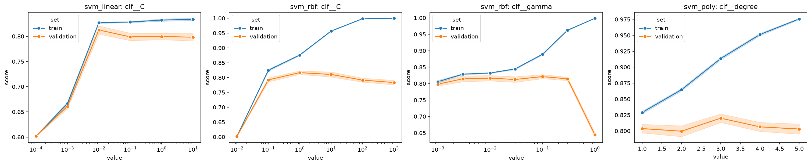
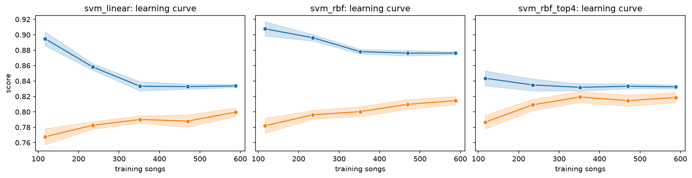
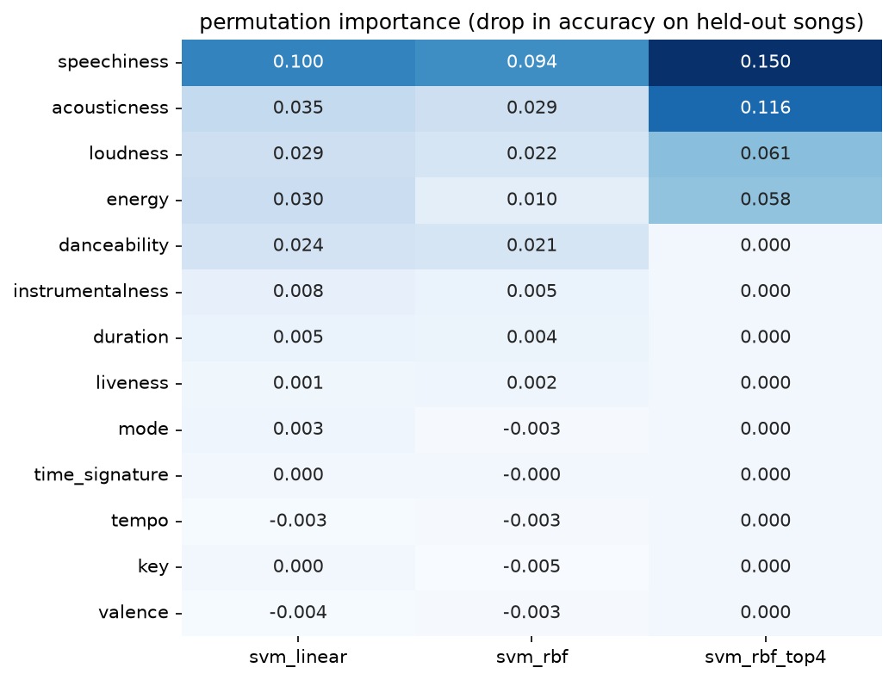
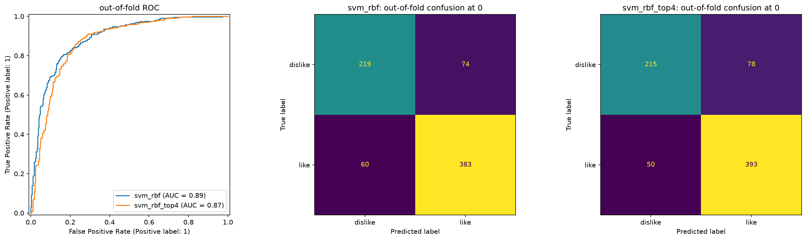

# 04 Variants: the SVM family

The kernel, the margin, and the scale the kernel sees. Eight variants
of the two registry SVMs, run under the screen (`results/protocol.md`,
2026-10-02: the protocol's stratified 5 folds at seed 65, two repeats
instead of five, so ten outer splits, every search inside each outer
training part). `make variants FAMILY=svm` writes
`results/04-variants-svm.csv` in about four minutes on 4 cores and
skips everything on a rerun. Every number below is a screen number
from that file (or, where logistic regression is the reference, from
`04-variants-linear.csv`, the same ten splits). None of them is a
full-protocol number and none should be set beside 03-sweep's table
as if it were.

## The family under the screen

Mean over the ten splits with the corrected error. The gap is paired
against the variant's own base on the same splits: `svm_linear` for
itself, `svm_rbf` for every other row, the polynomial included
(it starts from the RBF entry with the kernel swapped).

| variant | what changes | accuracy | balanced acc. | ROC AUC | gap to base | setting chosen most often (of 10) |
|---|---|---|---|---|---|---|
| svm_rbf_top4 | speechiness, loudness, acousticness, energy only | **0.825 ± 0.018** | 0.809 ± 0.018 | 0.875 ± 0.020 | +0.017 ± 0.021 | C 100, gamma 0.3 (6) |
| svm_rbf_quantile | rank-to-normal scaling | 0.821 ± 0.022 | 0.813 ± 0.022 | 0.890 ± 0.016 | +0.013 ± 0.023 | C 1, gamma 0.01 (4) |
| svm_rbf_numeric | key, mode, meter dropped | 0.816 ± 0.015 | 0.801 ± 0.015 | 0.885 ± 0.010 | +0.008 ± 0.014 | spread over 7 settings |
| svm_linear | the baseline | 0.813 ± 0.015 | 0.798 ± 0.014 | 0.886 ± 0.010 | | C 0.01 (10) |
| svm_poly | polynomial kernel, degree 2 or 3 | 0.811 ± 0.015 | 0.796 ± 0.014 | 0.893 ± 0.013 | +0.003 ± 0.006 | C 0.1, degree 3 (5) |
| svm_rbf_log | log1p on the four spiky features | 0.810 ± 0.014 | 0.796 ± 0.014 | 0.890 ± 0.013 | +0.002 ± 0.005 | C 1, gamma 0.03 (4) |
| svm_rbf | the baseline | 0.808 ± 0.014 | 0.794 ± 0.015 | 0.888 ± 0.014 | | C 1, gamma 0.03 (4) |
| svm_rbf_robust | median and IQR scaling | 0.760 ± 0.017 | 0.737 ± 0.017 | 0.848 ± 0.018 | **-0.048 ± 0.015** | C 10, gamma 0.01 (5) |

Seven of the eight sit inside 0.808 to 0.825, and every gap among
them is smaller than its own error. One knob moved the score beyond
the error of the gap, and it moved it down: robust scaling costs the
RBF five points, losing on all ten splits.

**What promotion sends on.** `variants.promoted` takes the family's
best mean, `svm_rbf_top4`, and asks whether its gap to `svm_rbf`
exceeds the corrected error of that gap: +0.017 against 0.021, so it
does not clear the rule, and the SVM family promotes nothing to the
full protocol.

## The figures



`figures/04-svm/validation-curves.png`: one hyperparameter swept with
the rest at sklearn's defaults (C 1, gamma `scale`), train and
validation accuracy over the screen's ten splits, the band one
standard error. Left to right: `C` on the linear SVM, `C` on the RBF,
`gamma` on the RBF, `degree` on the polynomial.



`figures/04-svm/learning-curves.png`: train and validation accuracy
against the number of training songs, at the defaults, for
`svm_linear`, `svm_rbf` and the family's best, `svm_rbf_top4`.



`figures/04-svm/permutation-importance.png`: the tuned pipeline
(inner search on) fitted on each screen fold's training part, then
the drop in validation accuracy when one original column is shuffled,
averaged over the ten folds. Rows ordered by mean rank across the
three methods.



`figures/04-svm/roc-confusion.png`: every song predicted once, by a
tuned model that never saw it (one 5-fold split at seed 65). The ROC
is built from `decision_function`, the signed distance to the
boundary, since an SVM gives no probability; the confusion matrices
threshold it at 0.

**The chosen `(C, gamma)` per split**, from the `params` column:

| variant | C 1, γ 0.01 | C 1, γ 0.03 | C 1, γ 0.1 | C 10, γ 0.01 | C 10, γ 0.03 | other |
|---|---|---|---|---|---|---|
| svm_rbf | 3 | **4** | 1 | 1 | 1 | |
| svm_rbf_log | 3 | **4** | 2 | | | C 10, γ 0.1 (1) |
| svm_rbf_quantile | **4** | 3 | 3 | | | |
| svm_rbf_robust | 1 | | 3 | **5** | 1 | |
| svm_rbf_numeric | | 1 | 2 | 2 | 2 | C 1, γ 0.3 (1); C 10, γ 0.1 (1); C 100, γ 0.01 (1) |
| svm_rbf_top4 | | | | | | **C 100, γ 0.3 (6)**; C 100, γ 0.1 (4) |

**The margin made visible.** The RBF pipeline refitted on all 736
deduplicated songs at its modal setting (C 1, gamma 0.03) keeps
**366 support vectors, 182 dislikes and 184 likes, half the training
set**. 331 of them sit at the bound `|α| = C`, meaning they are inside
the margin or on the wrong side of the boundary; only 35 lie exactly
on the margin. Its training accuracy is 0.842. The linear SVM at its
modal C 0.01 keeps 427 (58%). `svm_rbf_top4` at C 100, gamma 0.3
keeps 282, 203 of them at the bound.

## Reading

**What the kernel buys over the linear margin: nothing on all the
features, something on four.** On the full 28 columns the RBF sits
0.005 ± 0.014 *below* the linear SVM, winning five of ten splits: a
coin. The validation curve for gamma says why. It is flat from 0.003
to 0.3 (0.815 to 0.821), and the searches settle at 0.01 to 0.03.
In the book's notation the RBF is the squared exponential with
`gamma = 1/(2ℓ²)` (Kernel theory and the representer theorem, (8.25)),
so gamma 0.03 is a length scale of about 4 standard deviations and
0.01 one of about 7. Most songs sit within two or three standard
deviations of the centre on every axis, so over the whole data cloud
such a kernel barely bends: the boundary it draws is close to the
hyperplane the linear SVM draws. The kernel was offered curvature and
declined it. On the four strong features the picture changes:
`svm_rbf_top4` picks C 100 and gamma 0.1 to 0.3 every time, a sharp,
hard-margin boundary, and beats `logreg_top4` on the same ten splits
by 0.021 ± 0.011, winning nine. In four dimensions there is room for
the kernel to find the thresholds the exploration saw (every song
quieter than -20 dB liked, the speechiness cliff) without paying for
24 nuisance columns in every distance. It is still not more than
noise against its own base, `svm_rbf` (+0.017 ± 0.021), which is the
comparison the promotion rule makes. Its ROC AUC also drops (0.875
against 0.888): it ranks songs worse and thresholds them better, a
boundary tuned for accuracy at 0 rather than a smooth score.

**Where gamma sits against sklearn's `scale`.** `scale` sets
`gamma = 1/(n_features · Var(X))` on the preprocessed columns. On the
28 columns of the baseline pipeline that is 0.079, not the 1/28 the
comment in `models.py` assumes, because the one-hot columns have
variance well under 1 and pull the average down. The searches choose
3 to 8 times smaller: a smoother boundary than sklearn's default, with
a longer length scale. The validation curve at C 1 agrees that the
default does no harm (0.821 at 0.1) and that the cliff is far above it:
at gamma 1 the kernel sees every song as unlike every other, training
accuracy goes to 0.999 and validation to 0.645, one step from always
saying "like". The C curve tells the same story from the other side:
past C 1 training accuracy climbs to 1.000 while validation falls from
0.817 to 0.783. On top4 `scale` is 0.25 and the search lands on it.

**The polynomial kernel adds nothing the RBF does not.** +0.003 ±
0.006 against `svm_rbf` and -0.001 ± 0.010 against the linear SVM.
The book singles it out as the kernel whose feature space is finite,
monomials up to the degree, so it "enables nothing the primal
formulation could not do explicitly" (Kernel theory and the
representer theorem, "A catalogue"; Non-linear input transformations
builds the same features by hand). Degree 3 is picked half the time
and its validation curve peaks there (0.820 against 0.804 at degree 1),
but with C 0.1 it is held so close to the line that it scores like
one. Its ROC AUC is the family's highest (0.893), the one hint that
the cubic terms sort the middle of the ranking a little better.

**What scaling does to an RBF: the kernel sees distances, so it sees
the scaler.** The RBF's similarity is `exp(-γ‖x - x'‖²)`, a function
of one distance across every column at once. Standard scaling gives
every numeric column variance 1. Robust scaling divides by the
interquartile range instead, and instrumentalness has an IQR of
0.0024 (three quarters of the songs are near zero, a few are
instrumental at up to 0.97), so after robust scaling it has variance
about 12,000 against 1 to 2 for everything else, and `scale`'s gamma
on that pipeline is 0.00007. Every distance the kernel measures is the
instrumentalness distance, and the other twelve features are close to
invisible: that is the five points it loses on average (between 1.4
and 8.8 per split, and a loss on every one of the ten), and why
permutation importance on the standard pipeline ranks instrumentalness
sixth (0.005) while robust scaling made it the only feature. Quantile
scaling is the opposite cure, ranks mapped to a normal shape so no
column has a tail at all, and it is the best scaler here (+0.013),
though with the widest error in the family (0.022). log1p on the
spiky four changes nothing (+0.002 ± 0.005): after standard scaling
their tails are already a few standard deviations, which a length
scale of 4 to 7 does not notice. kNN measures the same Euclidean
distance on the same pipeline, so this is exactly where the two
families should rhyme: robust scaling should hurt kNN for the same
reason, and quantile should be at least neutral. If 04-knn shows
otherwise, one of the two readings is wrong.

**Why the linear SVM and logistic regression land together.** Under
the screen the linear SVM is 0.813 and logistic regression 0.815, a
gap of -0.002 ± 0.007. Fitted on all songs at their modal C, their
coefficient vectors have cosine 0.989 and the two classify 98% of the
training songs the same way: speechiness the strongest, then
acousticness, loudness, energy, danceability, in the same order and
nearly the same proportions. The book frames the two as the same
`L²`-regularised linear model with different losses (Support vector
classification, "The hinge loss" and "Intuition"): the logistic loss
lets every point keep pulling, the hinge stops once a point clears
the margin. That difference matters when most points clear the margin
comfortably. Here they do not: with C 0.01 chosen on all ten splits,
the margin is wide and soft, 58% of the songs are support vectors, and
the hinge ends up listening to most of the same songs the logistic
loss does. When the classes overlap this much, the two losses find
the same line.

**Learning curves: the RBF on all features is still learning, on four
it has stopped.** `svm_rbf`'s validation accuracy is still rising at
588 songs (0.782 at 117, 0.815 at 588) with a train-validation gap of
0.06: variance, which more songs would pay down. The linear SVM has
flattened near 0.80 with a gap of 0.03, and `svm_rbf_top4` has met
and flattened by 352 songs at about 0.82 with a gap of 0.01: bias.
Four features have told the kernel all they can.

**Permutation importance agrees with the exploration.** Speechiness
is the feature every SVM leans on hardest (0.094 to 0.150), then the
loud-versus-acoustic axis. With all features, energy is worth only
0.010 to the RBF, because loudness and acousticness carry the same
axis and the kernel takes it from them; restricted to four, each of
the four is worth 0.06 to 0.15. key, mode, time signature, tempo and
valence are worth nothing to any of them, and dropping the
categoricals entirely (`svm_rbf_numeric`, +0.008 ± 0.014) does not
cost anything either.

**Out of fold.** At the threshold of 0 the RBF gets 0.818 of the
songs right and `svm_rbf_top4` 0.826, the difference being ten more
liked songs caught at the price of four more disliked ones let
through. The threshold table says 0 is close to the best threshold
for both (the best of the grid is within 0.005 of it), so nothing is
left on the table by deciding at the boundary.

## How these were made

Every figure is one `songtaste.diagnostics` call under `SCREEN` on
`evaluate.training_xy(SCREEN)`; nothing is drawn by hand:

```python
d.validation_curve_table("svm_linear", "clf__C", [1e-4, 1e-3, 1e-2, 1e-1, 1, 10], X, y, SCREEN)
d.validation_curve_table("svm_rbf", "clf__C", [0.01, 0.1, 1, 10, 100, 1000], X, y, SCREEN)
d.validation_curve_table("svm_rbf", "clf__gamma", [1e-3, 3e-3, 1e-2, 3e-2, 1e-1, 3e-1, 1], X, y, SCREEN)
d.validation_curve_table("svm_poly", "clf__degree", [1, 2, 3, 4, 5], X, y, SCREEN)
d.learning_curve_table(name, X, y, SCREEN)        # svm_linear, svm_rbf, svm_rbf_top4
d.permutation_table(["svm_linear", "svm_rbf", "svm_rbf_top4"], X, y, SCREEN, n_repeats=10, tuned=True)
d.oof_predictions(name, X, y, SCREEN)             # svm_rbf, svm_rbf_top4; plot_roc, plot_confusion
```

each drawn with its `plot_*` partner. The support-vector counts are
`clf.n_support_` of `d.resolve(name).pipeline(SPEC, 65)` with the modal
setting set and fitted on all 736 songs; `scale`'s gamma is
`1 / (n_columns · Var)` of that pipeline's preprocessed matrix. The
diagnostics took about two minutes, most of it the tuned permutation
importance.
