# 04 Trees: one tree, bagging, forests and boosting

The tree family of the variants stage (`songtaste.variants`,
`FAMILIES["trees"]`), run under the screen of `protocol.md`
(2026-10-02): the same stratified 5 folds at seed 65 as the sweep, two
repeats instead of five, so ten outer splits per variant, every search
inside each outer training part. `make variants FAMILY=trees` wrote
`04-variants-trees.csv` in about 40 minutes on 4 cores, nine tenths of
it the five forests. Every number below is a screen number from that
file or from a diagnostic run on the screen's splits. None of them is
a sweep number, and where the sweep says something different this note
says which is which.

The course reference is the vault's Book Topics for this course, cited
by file: `Book Topics/02 Trees and logistic regression/Decision trees.md`,
`Book Topics/03 Ensembles and kernels/The bootstrap and bagging.md`,
`Random forests.md`, `Boosting and AdaBoost.md` and `Gradient boosting.md`
in the same folder.

## The family under the screen

Mean over the ten splits with the corrected standard error. The gap is
the paired difference to the variant's own base on the same ten splits
(positive means the variant helped), with the corrected error of that
difference. "sd" is the plain standard deviation of the ten per-split
accuracies, the width the boxplot below shows.

| variant | what changes | accuracy | ROC AUC | gap to base | se of gap | sd |
|---|---|---|---|---|---|---|
| rf_grouped | rare key and meter levels share one column | **0.831 ± 0.015** | 0.912 | +0.001 | 0.008 | 0.026 |
| rf | the base: 300 trees, `max_features`, `min_samples_leaf` searched | 0.830 ± 0.012 | 0.910 | | | 0.021 |
| rf_shallow | `max_depth` 3/5/8 searched instead of leaf size | 0.828 ± 0.015 | 0.905 | -0.002 | 0.007 | 0.026 |
| rf_numeric | key, mode, meter dropped | 0.826 ± 0.014 | 0.909 | -0.004 | 0.008 | 0.024 |
| boosting_slow | learning rate 0.01/0.03, 300/600 rounds | 0.824 ± 0.013 | 0.898 | +0.004 | 0.010 | 0.021 |
| bagging | the base: 300 full-feature trees | 0.821 ± 0.014 | 0.903 | | | 0.023 |
| boosting_top4 | speechiness, loudness, acousticness, energy only | 0.821 ± 0.018 | 0.889 | +0.001 | 0.013 | 0.030 |
| rf_top4 | the same four only | 0.821 ± 0.015 | 0.890 | -0.010 | 0.015 | 0.025 |
| boosting | the base: histogram gradient boosting | 0.820 ± 0.017 | 0.900 | | | 0.028 |
| adaboost | the base: stumps | 0.815 ± 0.008 | 0.889 | | | 0.014 |
| tree_top4 | the four only | 0.800 ± 0.007 | 0.851 | +0.007 | 0.015 | 0.013 |
| tree | the base: one tree, depth and leaf size searched | 0.793 ± 0.017 | 0.855 | | | 0.029 |
| tree_none | no scaler | 0.793 ± 0.017 | 0.855 | 0.000 | 0.000 | 0.029 |

No variant moved its base by more than the error of the gap. The
reading below is about why, which is the part the table cannot say.

## The scaler changes no split

`tree_none` matches `tree` exactly: the same accuracy on every one of
the ten splits, and the same hyperparameters chosen on every split
(checked on the CSV, not on the means). That is the expected result
and worth having as a check rather than a claim. A split asks "is
loudness below t?", and a standardisation maps every threshold to
another threshold without reordering a single song, so the tree finds
the same partition in different units (`Decision trees.md`, the model
as a partition of the input space into axis-aligned boxes). It is why
the sweep could keep the shared scaler on the tree-based methods
without cost, and it is the one variant in the whole stage whose
answer was known before it ran.

## One tree, and why its search chose shallow trees

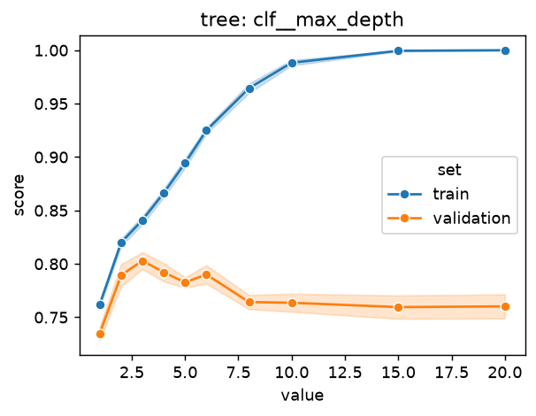

`figures/04-trees/validation-tree-max-depth.png`, at the default leaf
size of one. Training accuracy climbs from 0.76 at a stump to 1.00 by
depth 15. Validation accuracy peaks at depth 3 (0.803) and slides to
0.760 once the tree is grown out, where it has learned the training
songs by heart. Between depth 2 and 6 the curve is flat within the
split-to-split noise (0.79 to 0.80, spread 0.03), so the inner search
on each split had no strong reason to prefer one of them, and it
didn't settle hard: under the screen it chose depth 3 on 5 of the 10
splits, 4 on 3 and 6 on 2, and `min_samples_leaf` 20, the largest on
the grid, on 6 of 10. Both
knobs pull the same way, towards fewer and larger regions with more
songs averaged per leaf. This is the book's own figure 2.11 on its own
music data, where depth 4 beats the fully grown tree
(`Decision trees.md`, "How deep should a tree be?"), and the sweep saw
the same choice on 25 splits.

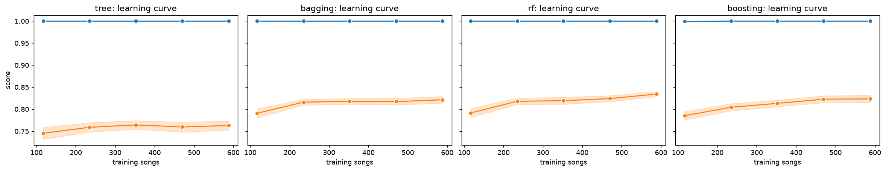

`figures/04-trees/learning-curves.png` (blue training, orange
validation, every model at its defaults, so the tree here is fully
grown). The tree's validation line is flat at about 0.76 from 235
songs on, with training accuracy pinned at 1.0. A gap that size which
more data does not close is the signature of variance in a model that
chooses its own size: every extra song just gets its own leaf. The
fix is not more songs, it is a smaller tree or many of them averaged.

The top-four tree is the one result of the family that looks like a
gain and isn't: +0.007 over the full tree with an error of 0.015. What
it does show is the tightest spread of any tree variant (sd 0.013
against 0.029). With only the four strong features, the tree has
fewer ways to chase noise, so its splits move less from fold to fold.
Removing candidate features is a crude variance control on one tree,
the same lever the forest pulls cleverly.

## Bagging against the forest: what decorrelating buys

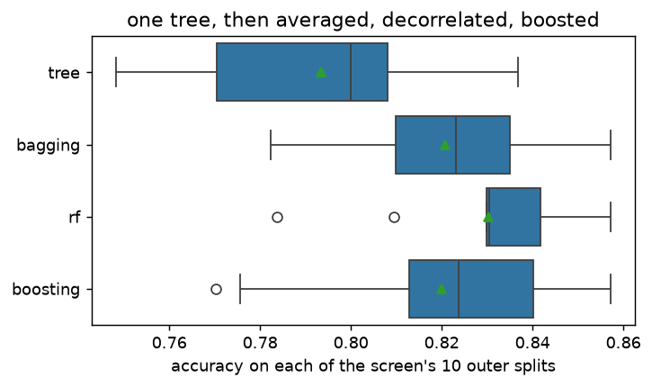

`figures/04-trees/accuracy-by-split.png`: the ten per-split accuracies
of tree, bagging, rf and boosting. Averaging 300 grown trees moves
the box up by 0.027 (bagging minus tree, paired, error 0.015, bagging
ahead on 9 of 10 splits) and narrows it (sd 0.029 to 0.023). The
forest moves it up again by 0.0095 over bagging (error 0.0066, ahead
on 8 of 10) and narrows it to 0.021, with the middle half of its
splits packed between 0.83 and 0.84. The narrowing is real but modest,
and it should be read with the sweep's warning in mind: most of the
spread of any box is which songs land in a fold, shared by every
method, which is why the gaps above are paired.

The arithmetic behind both steps is (7.2b) in
`The bootstrap and bagging.md`: the variance of an average of B
correlated trees is (1 − ρ)σ²/B + ρσ². Three hundred trees kill the
first term, so what is left is ρσ², the correlation floor. Bagging
cannot touch ρ. The forest lowers it by letting each split see only a
random subset of the columns (`Random forests.md`, "Why deliberately
handicapping each tree helps"). The book's case for when this pays is
"one input variable is clearly dominant", and that is this data
exactly: speechiness carries more than half of the forest's held-out
importance (below), so under bagging nearly every tree opens on
speechiness and the trees agree too much. The bagging-to-forest gap,
about one point, is the price of that agreement.

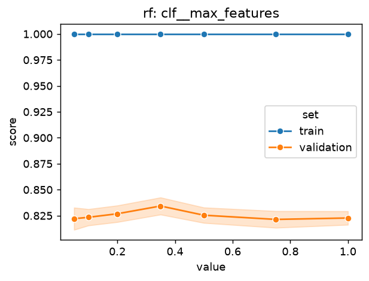

`figures/04-trees/validation-rf-max-features.png` makes the same point
as a curve, with the caveat that the fractions are of the 28 encoded
columns, not of the 13 features. At 1.0 the forest is bagging. The
validation score rises gently from 0.823 there to 0.834 at a third of
the columns and falls again to 0.822 at one in twenty, the
handicapped trees getting too weak. The peak is shallow and inside
the noise of single values, which is why the inner search spread its
choices between `sqrt` (about 0.19 of the columns), 0.25 and 0.5 and
never settled, as it didn't in the sweep either.

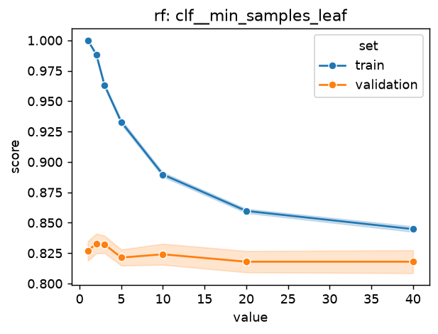

`figures/04-trees/validation-rf-min-samples-leaf.png`: training
accuracy falls from 1.0 at leaf size 1 to 0.85 at 40, validation
barely moves (0.818 to 0.833). A single tree pays dearly for growing
deep, the forest hardly at all, because averaging already does the
regularising that the leaf size would. `rf_shallow` says the same from
the other side: given depths 3, 5 and 8 instead of leaf sizes, its
search took the deepest on 8 of 10 splits and still came out 0.002
behind the base. "No depth limit needed (the averaging handles
overfitting)", as `Random forests.md` puts it, holds here.

The learning curves add one thing the boxes don't: the forest's
validation line is the only one still rising at the full training
size (0.824 at 470 songs, 0.834 at 588), where bagging's has flattened
at about 0.82. Read with care, since the last step is about one
standard error, but it is the shape the variance story predicts: the
forest has more variance left to average away, so it is the model that
would gain most from more songs.

## What feature subsets and grouped levels do to a forest

Nothing, within the screen's resolution, and the reason is the useful
part. A forest already ignores a noise feature, because a split on
key or meter rarely wins against a split on speechiness or loudness,
so dropping those columns (`rf_numeric`, -0.004) or grouping their
rare levels (`rf_grouped`, +0.001) changes which columns the random
subsets can draw, not what the trees learn. Cutting to the top four
(`rf_top4`, -0.010 with error 0.015) is the largest move, and it is
the one that shows up in the ranking more than in the accuracy: ROC
AUC falls from 0.910 to 0.890, and the same happens to boosting on the
top four (0.900 to 0.889) while its accuracy holds. The nine weaker
features barely change which side of 0.5 a song lands on, but they
help order the songs near the boundary. And there is a second, subtler
cost: with four columns the random subsets have little to choose
from, so the trees decorrelate less. The forest's trick needs columns
to hide.

## Whether slower boosting catches the forest

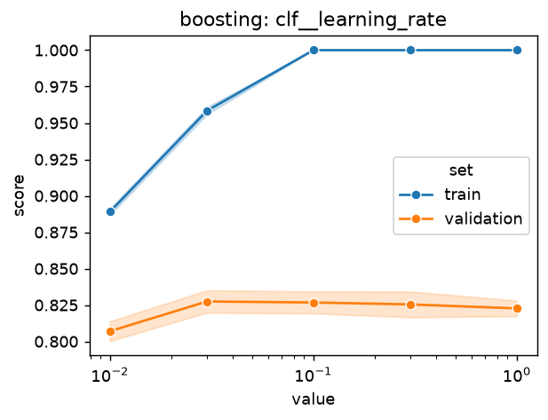
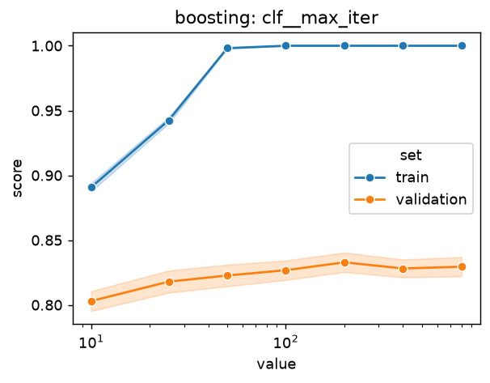

Almost, not quite. `boosting_slow` (learning rate 0.01 or 0.03, 300
or 600 rounds) gains 0.004 on plain boosting (error 0.010) and ends
0.006 behind the forest (error 0.012, the forest ahead on 6 of 10
splits). Its search took the slowest rate, 0.01, on 6 of 10 splits
and depth 2 on 8 of 10, so given the choice it did prefer small
steps on small trees. The plain search had already drifted the same
way (depth 2 on 6 of 10, rate 0.03 or 0.1 on 9), the trade-off
`Gradient boosting.md` describes: a smaller step needs more rounds
for the same fit, and buys a smoother sum of trees. The gain is
less than half its own error.

The two curves, at the library defaults (31 leaves per tree), say why
it does not matter much here. Against the learning rate, validation
is flat from 0.03 to 1.0 (0.823 to 0.827); only 0.01 at 100 rounds is
too slow to fit (0.807). Against the number of rounds it climbs to
0.833 at 200 and stays within half a point of that to 800, while
training accuracy hit 1.0 by round 100. That is the slow overfitting
`Boosting and AdaBoost.md` describes ("in practice the overfitting is
slow and performance is fairly insensitive to B"), and on 590 songs
it is slow enough not to be seen. Boosting reaches the forest's
neighbourhood from the bias side, removing it step by step with small
trees, and the screen cannot tell the two apart (forest minus
boosting 0.010, error 0.008).

## Where adaboost's stumps sit

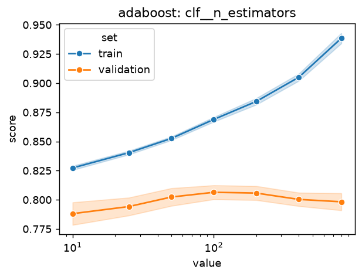

Last of the ensembles, 0.015 behind the forest (error 0.011, the
forest ahead on 8 of 10), and the one validation curve in the family
that shows boosting starting to overfit. At the default learning rate
of 1.0, validation rises from 0.788 at 10 stumps to 0.806 at 100 to
200, then slips to 0.798 at 800 while training accuracy keeps climbing
(0.87 to 0.94). The book's example 7.6 shows the same upturn
(`Boosting and AdaBoost.md`, "How many iterations B"). The inner
search avoided it by pairing a small rate with many stumps or a larger
one with fewer.

Stumps cost adaboost something specific on this data. A depth-one
tree can only say "speechiness above t" or "loudness below t", one
feature at a time, so a sum of stumps is an additive model: it can
bend each feature's effect but cannot express an interaction. The
gradient boosting above used deeper trees and the forest grows them
out, and both come out ahead. Adaboost has the tightest spread of the
whole family (sd 0.014), which is the other half of the same fact:
a high-bias, low-variance learner, steady and slightly wrong.

## Two notions of importance

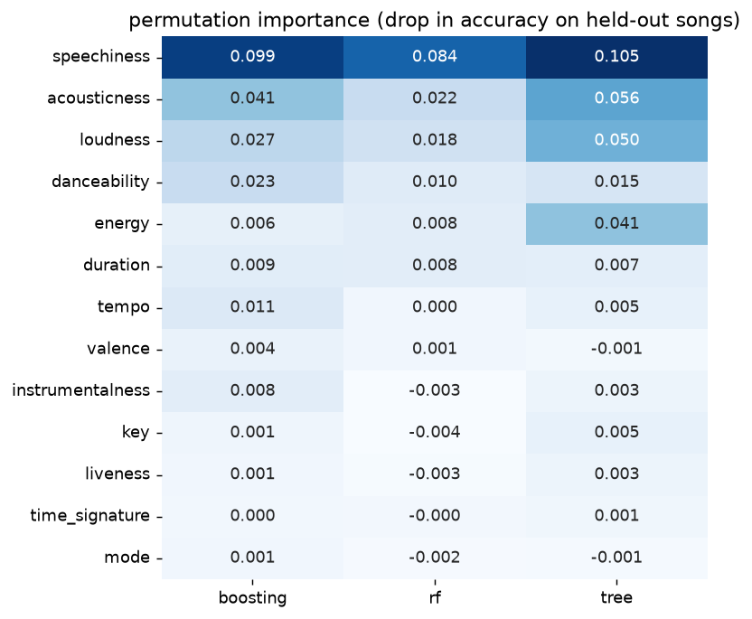

`figures/04-trees/permutation-importance.png`: for tree, rf and
boosting at their defaults, the drop in held-out accuracy when one
original column is shuffled, averaged over the ten splits. All three
agree on the top: speechiness first by a distance (0.08 to 0.11 of
accuracy), then acousticness and loudness. The single tree also leans
hard on energy (0.041) where the ensembles hardly do (0.006 to 0.008):
energy and loudness are strongly correlated, and one greedy tree picks
one of them while the ensembles spread the job and lose little when
either is shuffled.

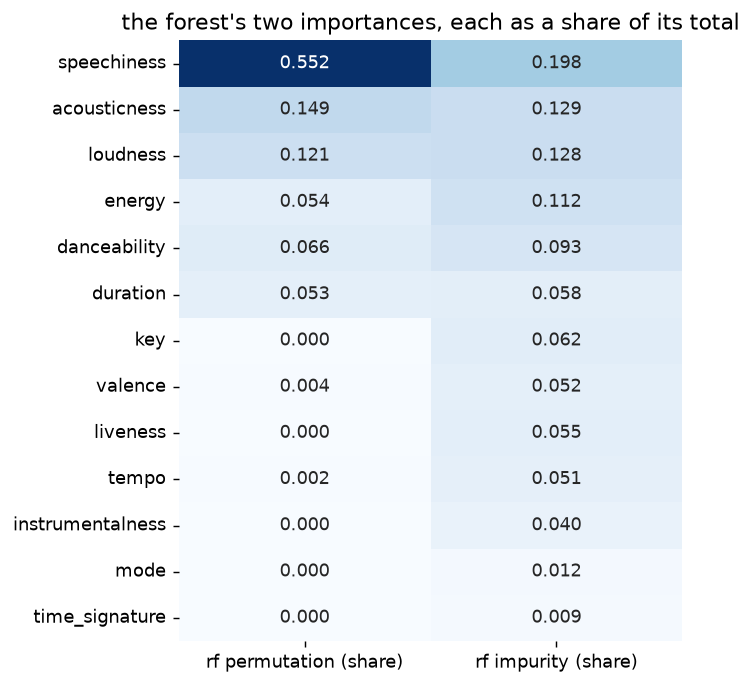

`figures/04-trees/importance-rf-impurity-vs-permutation.png` sets the
forest's permutation importance beside its own impurity importance
(`clf.feature_importances_`, the total impurity decrease each column
earned across the trees, the one-hot columns summed back to their
feature, averaged over the ten training parts), each as a share of its
total. The quantity is the one `Random forests.md` describes as the
by-product of the construction.

They agree on the top three, in the same order: speechiness,
acousticness, loudness. They disagree on two things, both instructive.

- **Key.** Impurity ranks it sixth with 6% of the total. Permutation
  ranks it last: shuffling key leaves held-out accuracy where it was,
  slightly negative on average. Impurity importance is earned on the
  training songs, and key arrives as twelve one-hot columns, each
  with about half a percent. A fully grown tree near its leaves has
  few songs per node and will split on anything that separates them,
  and a feature with twelve columns gets twelve chances. Those splits
  fit noise, and noise does not survive onto held-out songs. Liveness,
  valence and tempo show the milder version of the same thing: 5% each
  by impurity, about nothing by permutation. Impurity importance
  measures where the trees spent their splits; permutation importance
  measures what the splits were worth.
- **Speechiness.** Permutation gives it 55% of the total, impurity
  20%. Impurity spreads credit across every split a feature earns,
  including the late noise ones; permutation charges the whole loss
  when the feature is gone. One feature carries this forest, which is
  also the dominance the decorrelation argument above leans on.

For the report the takeaway is that the robust ranking is the
permutation one, and that it agrees with the exploration
(`01-exploration.md`): speechiness, acousticness, loudness are the
features every tree-based method leans on, and key, mode and meter
are worth nothing to them. That is also why dropping them
(`rf_numeric`) or grouping them (`rf_grouped`) moved nothing.

## Out of fold, and the threshold

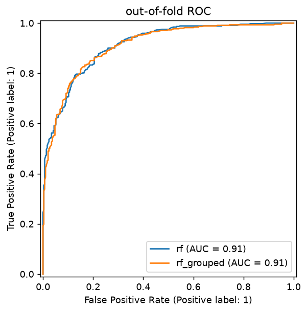

`figures/04-trees/roc.png`, `confusion-rf.png` and
`confusion-rf_grouped.png`: every song predicted once by a model,
inner search on, that never saw it (one stratified 5-fold at the
screen's seed). The forest and the family's best variant,
`rf_grouped`, are the same model to within a few songs: AUC 0.913
against 0.911, 615 and 613 of 736 songs right at 0.5. Both err more
on the dislikes than the likes (65 and 63 of 293 disliked songs
called liked, against 56 and 60 of 443 liked songs called disliked).
Accuracy against the threshold on the same out-of-fold scores peaks
at 0.5 for the forest, and for `rf_grouped` 0.4 and 0.5 tie at 0.833,
so the protocol's threshold leaves nothing on the table.

## What `variants.promoted` would promote

Nothing. The family's best variant under the screen is `rf_grouped`,
0.831, and its gap to `rf` is +0.001 against a corrected error of
0.008. The rule (`protocol.md`, 2026-10-02) asks for the gap to exceed
the error, and it is an eighth of it. `variants.promoted` on this file
returns an empty frame. The forest as the sweep ran it stays the
family's representative, and nothing from this family needs the full
protocol.

## How the figures were made

Every figure is one `songtaste.diagnostics` call on the screen's
splits, at the defaults except where named, plus the one seaborn
boxplot from `04-variants-trees.csv`; together about five minutes on 4
cores.

```python
from songtaste import evaluate, diagnostics as d
from songtaste.variants import SCREEN
X, y = evaluate.training_xy(SCREEN)
d.validation_curve_table("tree", "clf__max_depth", [1, 2, 3, 4, 5, 6, 8, 10, 15, 20], X, y, SCREEN)
d.validation_curve_table("rf", "clf__min_samples_leaf", [1, 2, 3, 5, 10, 20, 40], X, y, SCREEN)
d.validation_curve_table("rf", "clf__max_features", [0.05, 0.1, 0.2, 0.35, 0.5, 0.75, 1.0], X, y, SCREEN)
d.validation_curve_table("boosting", "clf__learning_rate", [0.01, 0.03, 0.1, 0.3, 1.0], X, y, SCREEN)
d.validation_curve_table("boosting", "clf__max_iter", [10, 25, 50, 100, 200, 400, 800], X, y, SCREEN)
d.validation_curve_table("adaboost", "clf__n_estimators", [10, 25, 50, 100, 200, 400, 800], X, y, SCREEN)
# each drawn with d.plot_validation_curve
d.plot_learning_curves([d.learning_curve_table(n, X, y, SCREEN) for n in ["tree", "bagging", "rf", "boosting"]], ncols=4)
pt = d.permutation_table(["tree", "rf", "boosting"], X, y, SCREEN, n_repeats=10)
d.plot_importance_matrix(d.importance_matrix(pt))
# the forest's impurity importances: d.resolve("rf").pipeline(...) fitted on each screen training part,
# clf.feature_importances_ against pre.get_feature_names_out(), one-hot columns summed to their feature,
# then both as shares in one frame through d.plot_importance_matrix
oofs = [d.oof_predictions(n, X, y, SCREEN) for n in ["rf", "rf_grouped"]]
d.plot_roc(oofs); d.plot_confusion(oofs[0]); d.plot_confusion(oofs[1]); d.threshold_table(oofs[0])
sns.boxplot(rows[rows.variant.isin(four)], x="accuracy", y="variant", order=four, showmeans=True)
```
