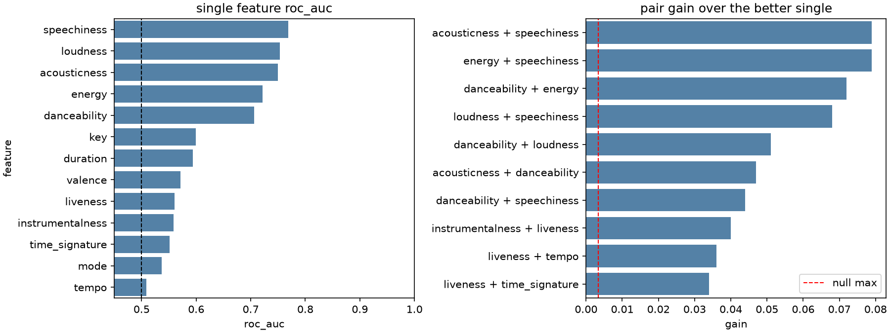
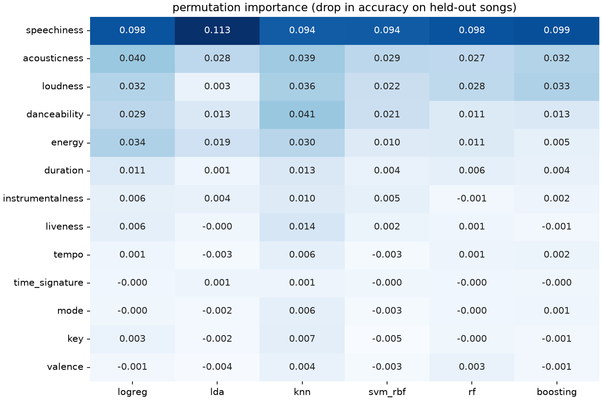
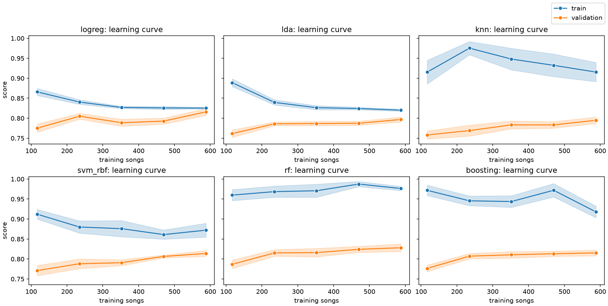

# 04 Variants: what the knobs did, across the four families

The variants stage closed. Four families went through the screen
(`protocol.md`, 2026-10-02: the protocol's stratified 5 folds at seed
65, two repeats instead of five, so ten outer splits, every search
inside the outer training part), each written up in its own note
(`04-linear.md`, `04-knn.md`, `04-svm.md`, `04-trees.md`). This note
reads across them, for the two questions his exploration asked:
**which features are robustly important across methods**, and **what
each family is sensitive to**. Then it takes the one variant the
screen promoted through the full protocol and applies the decision
rule to the larger table.

Two kinds of number appear here and they are never mixed. **Screen
numbers** come from the four `04-variants-<family>.csv` files and the
diagnostics in `figures/04-synthesis/`, all on the screen's ten
splits; they are questions, not candidates. **Full-protocol numbers**
come from `03-sweep.csv` and `04-variants-full.csv`, on the 25 splits
the decision rule reads. Each table says which it is.

`make synthesis` (`songtaste.synthesis`) runs every step below and
writes each table behind a figure as a CSV beside it in
`figures/04-synthesis/`; a rerun reads those back and reprints
everything in seconds. The first run took about 20 minutes on 4 cores, most of it the searched learning curves and permutation importances.

## The feature screen

`explore.feature_screen` under the screen: a depth-4 tree scored by
ROC AUC on each feature alone and on each pair, with the same capacity
for both, so a pair's gain over its better member is interaction and
not an extra level of tree. The null is twenty shuffled copies of the
best single feature paired with the real one. This is a screen, not a
model: the numbers rank features for one small tree and say nothing
about accuracy under the protocol.

Alone, five features carry signal, in the order the exploration found:
speechiness (0.769), loudness (0.753), acousticness (0.750), energy
(0.722) and danceability (0.706). The next best, key, is at 0.599 and
tempo at 0.509 is a coin. The pairs that add most are speechiness with
the loud-acoustic axis: acousticness + speechiness and energy +
speechiness both gain 0.079 over speechiness alone, loudness +
speechiness 0.068. That is the structure every family below keeps
finding: one axis (loud, energetic, not acoustic) and speechiness
across it, two directions that each say something the other does not.

The null needs reading with care. A shuffled copy of speechiness gains
at most 0.003 (mean -0.011), so every one of the top ten pairs clears
it. But the null is built on the strongest feature, where the tree is
already near what one axis allows; on a weak feature the same tree has
room to spare, which is why liveness + tempo gains 0.036 from two
features that are near 0.5 alone. Read the gain against the pair's own
level: the five pairs among the strong features land at 0.80 to 0.85,
the weak pairs at about 0.60. The screen confirms the interaction
between speechiness and the loud-acoustic axis; it does not show the
weak features to be worth anything together.

## Permutation importance across methods

`diagnostics.permutation_table` for logistic regression, LDA, kNN,
the RBF SVM, the forest and gradient boosting, each searched inside
each of the screen's ten splits (`tuned=True`), then shuffled one
original column at a time on the held-out part, ten shuffles each. A
cell is the mean drop in held-out accuracy; rows are ordered by mean
rank across the six (`figures/04-synthesis/permutation.csv`).

| feature | logreg | lda | knn | svm_rbf | rf | boosting |
|---|---|---|---|---|---|---|
| speechiness | 0.098 | 0.113 | 0.094 | 0.094 | 0.098 | 0.099 |
| acousticness | 0.040 | 0.028 | 0.039 | 0.029 | 0.027 | 0.032 |
| loudness | 0.032 | 0.003 | 0.036 | 0.022 | 0.028 | 0.033 |
| danceability | 0.029 | 0.013 | 0.041 | 0.021 | 0.011 | 0.013 |
| energy | 0.034 | 0.019 | 0.030 | 0.010 | 0.011 | 0.005 |
| duration | 0.011 | 0.001 | 0.013 | 0.004 | 0.006 | 0.004 |
| instrumentalness | 0.006 | 0.004 | 0.010 | 0.005 | -0.001 | 0.002 |
| liveness | 0.006 | -0.000 | 0.014 | 0.002 | 0.001 | -0.001 |
| tempo, time_signature, mode, key, valence | | | | | | under 0.008 everywhere |

**What every method leans on.** Speechiness, first for all six and by
a factor of two to three over the next feature: shuffle it and any of
them loses 0.094 to 0.113 of accuracy, the same amount within a
hundredth whether the model is a line, a covariance, a distance, a
kernel or a forest. Then acousticness, the one other feature worth
0.027 or more to all six. These two are the robust answer to his
question, and they are the two the feature screen's best pair is made
of.

**Where they disagree, and why.** On the rest of the loud-acoustic
axis. Loudness is worth 0.022 to 0.036 to every method except LDA
(0.003), and energy is worth 0.030 or more to logistic regression and
kNN but 0.005 to 0.011 to the SVM and the trees. That is not
disagreement about the data: loudness, energy and acousticness are
close to one feature (rank correlation up to 0.85), and permutation
importance undercounts a feature that has a twin, because shuffling one
leaves the other carrying the axis. Which twin a method leans on is a
detail of the fit (LDA's pooled covariance puts it on acousticness and
energy, the trees pick whichever splits first); that the axis matters
is common to all six. Danceability is the one real difference: kNN
leans on it most (0.041, second in its column), logistic regression
moderately (0.029), the forest and boosting hardly (0.011, 0.013). It
separates the classes a little on its own and a lot less once the axis
is known, and a distance, which gives every axis a vote, uses it more
than a model that can learn to ignore it.

**What nothing leans on.** Tempo, time signature, mode, key and
valence are under 0.008 for every method, and negative for some,
which is noise around zero. Liveness and instrumentalness are worth
something only to kNN (0.014 and 0.010), duration to kNN and logistic
regression (0.013 and 0.011), and for kNN that is being
fooled rather than informed: a feature in the distance moves the
neighbours whether or not it separates the classes, so shuffling it
changes predictions. That is the arithmetic behind `knn_top4`.

The forest's own impurity importance tells a different story for key
(sixth by impurity, last by permutation; `04-trees.md`); permutation on
held-out songs is the ranking to quote.

## The learning curves side by side

`diagnostics.learning_curve_table` for the same six, the inner search
run at every training size (`tuned=True`), on the screen's ten splits
(`figures/04-synthesis/learning-curves.csv`). Blue is the training
score, orange validation, each band one standard error over the
splits.

| songs | logreg | lda | knn | svm_rbf | rf | boosting |
|---|---|---|---|---|---|---|
| 117, validation | 0.775 | 0.762 | 0.758 | 0.771 | 0.787 | 0.776 |
| 588, validation | 0.816 | 0.797 | 0.795 | 0.814 | 0.828 | 0.815 |
| 588, train | 0.825 | 0.820 | 0.915 | 0.872 | 0.976 | 0.918 |
| 588, gap | 0.009 | 0.023 | 0.120 | 0.058 | 0.148 | 0.103 |

Side by side they sort into two shapes. **The linear pair is limited
by bias.** Logistic regression's and LDA's training scores fall to
meet their validation scores, a gap of one to two points at 588 songs:
they fit the training songs about as badly as new ones, which is what
a model too simple for the data does, and more songs would not help
them much. **The others are limited by variance, to different
degrees.** The forest has the largest gap (0.148) and the best
validation line, still rising at the full training part (0.824 at 470,
0.828 at 588); it is the model that would gain most from more songs,
and its averaging is what makes a 0.98 training score cost so little.
Boosting and the RBF SVM sit between, with gaps of 0.10 and 0.06 and
validation lines that have nearly flattened. kNN's training line is
high only because `distance` weighting, which most of its searches
picked, scores each training song by itself, so its gap is not a
measure of fit; its validation line is the lowest and still climbing,
which is a method averaging away noise axes with every extra song. The
four-feature space removes those axes instead: `04-knn.md`'s learning
curve for `knn_top4` reaches 0.82 by 352 songs and stays there.

The curves say where each family's gains could come from: the line
from better features, not more data; kNN from a better space (which
the promoted variant is); the forest from more songs.

## Each family, and what it is sensitive to

Screen numbers, every one from the family's CSV, gaps paired against
the variant's own base with the corrected error of the gap.

### Linear: logistic regression, LDA, QDA

Logistic regression is insensitive to almost everything we turned. The
penalty (L2, L1, elastic net), the scaling (standard, robust,
quantile, log1p on the spiky four) and the encoding of the
categoricals (one-hot, rare levels grouped, dropped) all land within
half a point of 0.815, with gaps smaller than their errors; the best,
log1p, is +0.004 ± 0.005. What matters is C, and the search already
finds it (0.01 to 0.1 on every split). A straight boundary absorbs any
rescaling into its coefficients, and only a monotone bend changes what
it can express; with the tails a few dozen songs, the bend reaches few
decisions. L1 shows which features the line actually uses: at the C
the search chose, it keeps eight numeric features and sets every
one-hot column, liveness and valence to exactly zero, at no cost. The
only change that clearly hurts is throwing features away (top4,
-0.011 ± 0.010).

The covariance-based methods respond to having fewer parameters to
estimate. Ledoit-Wolf shrinkage lifts LDA by 0.012 ± 0.008, and QDA on
the four strong features gains 0.015 ± 0.009: a full covariance per
class over 28 columns, estimated from about 240 dislikes, is the
variance cost the course trades against LDA's shared one, and fewer
columns pay it down. Neither reaches plain logistic regression (0.806
and 0.790 against 0.815 on the same splits), and since the promotion
rule takes each family's best mean, neither was considered.

### kNN: the space the distance is measured in

kNN is the most sensitive family, because everything it knows sits in
what "closest" means. Standardised Euclidean distance gives every axis
the same vote, and on this data the six weak numeric features carry
about half of every squared distance, the one-hot columns 13%, the
four strong features only 35%. Restricting the space to those four
(top4) gains 0.020 ± 0.018 and is the one change that makes the
neighbourhood search settle: k between 5 and 15 on every split,
against 5 to 51 for the baseline, and a validation curve with a real
peak at k = 9 instead of a plateau. A rank-to-normal transform does
almost as well (+0.019 ± 0.018) by a different route, giving every axis
the same bounded shape so no tail sets the scale.

Robust scaling broke it: -0.043 ± 0.017, worse on all ten splits.
instrumentalness is so spiked at zero that its interquartile range is
essentially nothing, so dividing by it sends the few instrumental songs
out to about 400 and the distance becomes instrumentalness alone. The
log variant tested almost nothing, since log1p on a feature in 0 to 1
is close to the identity (the logged values correlate 0.996 to 0.999
with the raw ones). This is the family the screen promoted, and the
full protocol below is where its gain was tested.

### SVM: the kernel, the margin and the scale the kernel sees

On all 28 columns the RBF kernel adds nothing over the linear SVM: the
searches chose gamma 0.01 to 0.03, a length scale of 4 to 7 standard
deviations, so long that over the data cloud the boundary is nearly a
hyperplane. The kernel was offered curvature and declined it. On the
four strong features it bends (C 100, gamma 0.1 to 0.3 on every
split) and beats logistic regression on the same four by 0.021 ±
0.011, but against its own base, which is what the promotion rule
reads, the gain is +0.017 ± 0.021, inside its error. The polynomial
kernel scores like a line (+0.003 ± 0.006), and the linear SVM lands
with logistic regression (coefficient vectors at cosine 0.989): with
58% of the songs support vectors, the hinge listens to most of the
songs the logistic loss does.

The one knob that moved the family beyond its error moved it down.
An RBF kernel sees one distance across every column, so it sees the
scaler, and robust scaling gives instrumentalness a variance about
12,000 times anything else: -0.048 ± 0.015, a loss on every split.
That is the same failure as kNN's, for the same reason, and quantile
scaling is the best scaler in both families. The SVM note predicted the
two would rhyme, and they do: robust scaling is a property of this
data, a feature that is all spike, not of either method.

### Trees: the variance story

A single tree is the family's weakest member, and its search kept
choosing depth 3 or 4 with large leaves, because a grown tree learns
the training songs by heart (validation 0.76 against training 1.0).
Averaging is what makes trees work here: 300 bagged trees gain 0.027
± 0.015 over one, and the forest's random feature subsets add 0.0095 ±
0.0066 over bagging. That second gap is what decorrelating the trees
buys, and it is large here because speechiness carries more than half
of the forest's held-out importance, so bagged trees all open on it
and agree too much.

Nothing else we turned moved the forest beyond the screen's noise:
dropping the categoricals (-0.004 ± 0.008), grouping their rare
levels (+0.001 ± 0.008), limiting depth (-0.002 ± 0.007), slower
boosting (+0.004 ± 0.010). A forest already ignores a feature that
never wins a split, so these change what the random subsets can draw,
not what the trees learn. The scaler changed no split at all
(`tree_none` matched `tree` on every split), as it should. Cutting to
the top four costs the forest in ranking more than in accuracy (ROC
AUC 0.910 to 0.890): the weak features do not move many songs across
0.5, but they order the ones near it.

## The decision rule under its neighbours

`diagnostics.decision_sensitivity` reruns the choice under four
neighbouring rules, on 03-sweep's table and on the union with the
promoted variant (full protocol, 25 splits;
`figures/04-synthesis/decision-sensitivity.csv`). The qualifying sets
are listed in the rule's own order, fewest searched first.

| rule | chosen on 03-sweep | chosen on the union | qualifying on the union |
|---|---|---|---|
| within 1 corrected se (protocol.md) | rf | **knn_top4** | knn_top4, rf |
| within 2 corrected se | logreg | logreg | logreg, svm_linear, bagging, knn_top4, svm_rbf, rf, adaboost, boosting |
| corrected t-test p > 0.05 | logreg | logreg | the same eight |
| within the rope (gap > -0.01) | rf | knn_top4 | knn_top4, rf |
| best mean, no band | rf | rf | rf |

What turns on the strictness is which end of a flat top the rule
lands on. The strict rules (one error, the rope) admit only what is
practically level with the best, and then the count of searched
hyperparameters and the tie order decide. The loose ones (two errors,
the t-test) admit eight methods, and the simplest of them, logistic
regression with one searched hyperparameter, wins, as it did on the
sweep alone. Taking the best mean ignores the uncertainty altogether
and stays with the forest. Three different answers from five
reasonable rules is the honest picture of this table: the top eight
methods are within about two corrected errors of each other, and the
choice is made by the rule fixed before the numbers, not by the data
alone.

## Promotion, and the choice

`variants.promoted` over the four screening files, reading only the
screen's rows, promotes one variant:

| family | best on the screen | accuracy (screen) | gap to base | se of gap | promoted |
|---|---|---|---|---|---|
| linear | logreg_log | 0.819 | +0.004 | 0.005 | no |
| knn | knn_top4 | 0.821 | +0.020 | 0.018 | **yes** |
| svm | svm_rbf_top4 | 0.825 | +0.017 | 0.021 | no |
| trees | rf_grouped | 0.831 | +0.001 | 0.008 | no |

Two things the rule does not see, recorded so the report does not
overclaim either way. It reads one variant per family, so lda_shrink
and qda_top4, which do clear their own gaps, were never considered,
and neither was knn_quantile, level with top4 and behind it by 0.001.
And it reads each variant against its own base, which hid that
svm_rbf_top4 beats logistic regression on the same four features by
0.021 ± 0.011.

**knn_top4 under the full protocol** (`04-variants-full.csv`, 25
splits, `n_repeats` 5) scores **0.826 ± 0.017** in accuracy, 0.807 ±
0.020 balanced, 0.879 ± 0.015 ROC AUC. Joined to 03-sweep's twelve
methods as a thirteenth (`report.comparison`, `report.paired`):

| method | accuracy (full) | gap to rf | se of gap | p | searched |
|---|---|---|---|---|---|
| rf | 0.830 ± 0.014 | | | | 2 |
| knn_top4 | 0.826 ± 0.017 | -0.0046 | 0.0144 | 0.75 | 2 |
| bagging | 0.820 ± 0.014 | -0.0106 | 0.0072 | 0.15 | 1 |
| boosting | 0.819 ± 0.014 | -0.0109 | 0.0090 | 0.24 | 3 |
| logreg | 0.814 ± 0.019 | -0.0160 | 0.0149 | 0.29 | 1 |

(The rest of the table is 03-sweep's, unchanged.) rf is still the
best mean, and knn_top4 is the one method inside its one-error band.
Both search two hyperparameters (`n_neighbors` and `weights` for the
variant, from kNN's grid), so the tie goes by the simplicity order,
where a promoted variant takes its base method's place
(`protocol.md`, the dated section of 2026-10-02 that closes this
stage). kNN comes before the random forest. **Under the rule, the
choice moves from rf to knn_top4.**

Is that the screen's selection talking? The screen's ten splits are
the first two repeats of the full protocol's 25, so knn_top4 was
picked among about forty variants on ten of the splits it is now
scored on. On those ten it is 0.0096 behind rf. On the other fifteen,
which nothing in the stage had seen, it is 0.0014 behind rf (0.829
against 0.830) and 0.038 ahead of plain kNN. The result holds out of
sample; if anything the screen undersold it.

What the move means, sized honestly. The forest and the four-feature
kNN are level on accuracy (the forest wins 14 of 25 splits, kNN 8,
three ties; the posterior puts 0.49 on the two being within a point of
each other). They are not level on ranking: the forest's ROC AUC is
0.907 against 0.879, so the forest orders songs better and the kNN
thresholds them about as well. The rule decides on accuracy because
the leaderboard does. What it chooses is a model a person can explain
in one sentence: a song is liked when the seven to eleven songs nearest to
it, in speechiness, loudness, acousticness and energy, mostly were.

The submission string in `results/submission-2026-10-01.txt` was made
by the forest before this, and stays as it is. Whether to make a new
one with knn_top4 is his call; nothing here writes one.
